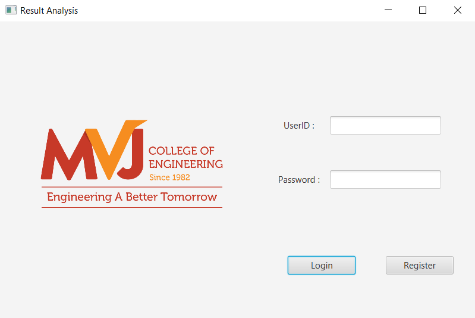
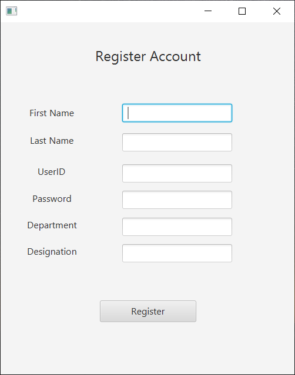
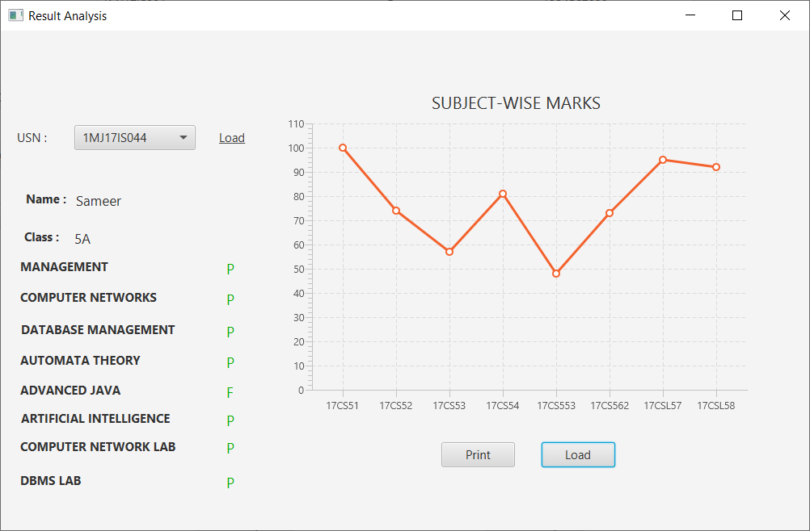
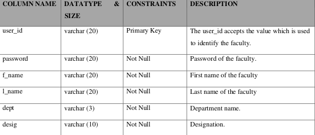
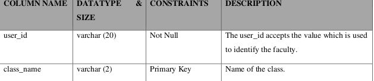
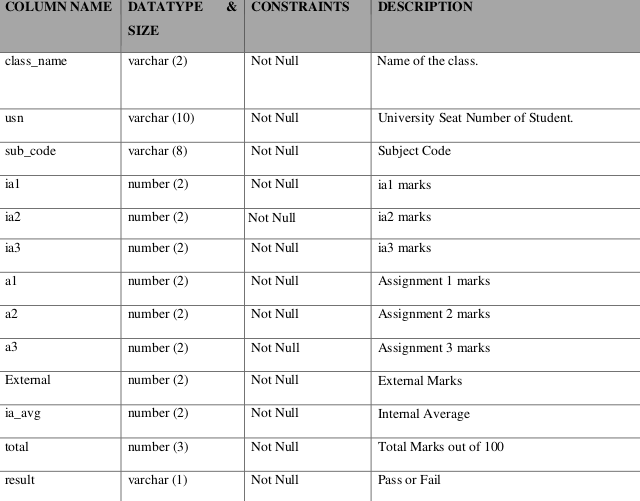
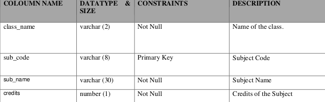
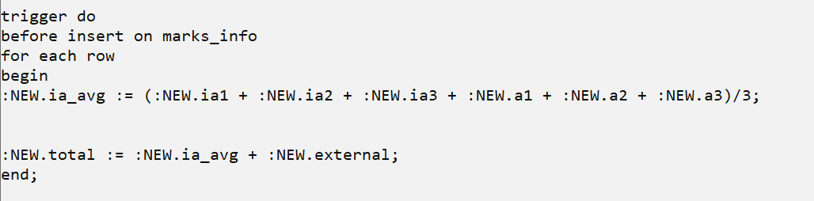

# Result-Analysis-System
Result Analysis System is a project made using [JavaFX](https://en.wikipedia.org/wiki/JavaFX#:~:text=JavaFX%20is%20a%20software%20platform,included%20for%20the%20foreseeable%20future.).\
It is a desktop based application developed for colleges to analyze the result and keep track of students.\
This project will manage

- Information about various user.
- Information about subjects offered in various semester.
- Marks obtained by student in semester.
- Generation of reports.
- Analysis of data based on aspects.

> Database Connectivity : **Oracle 10g XE**\
> External Library used: **itextpdf-5.4.0.jar**

### Screenshots

### Schema Used

1. faculty_register

2. class_info

3. marks_info

4. subject_info

5. marks_info

### Stored Procedure Used

### Trigger Used

